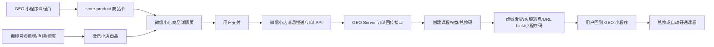
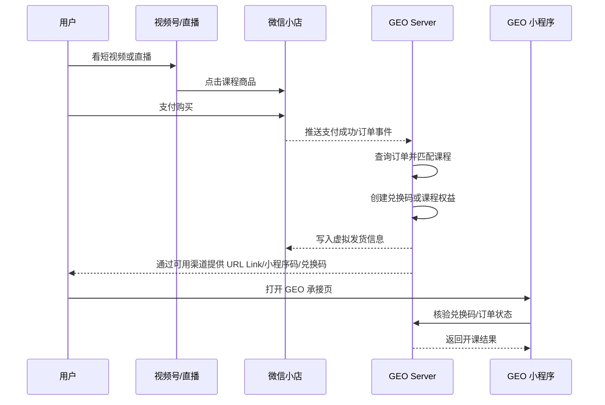
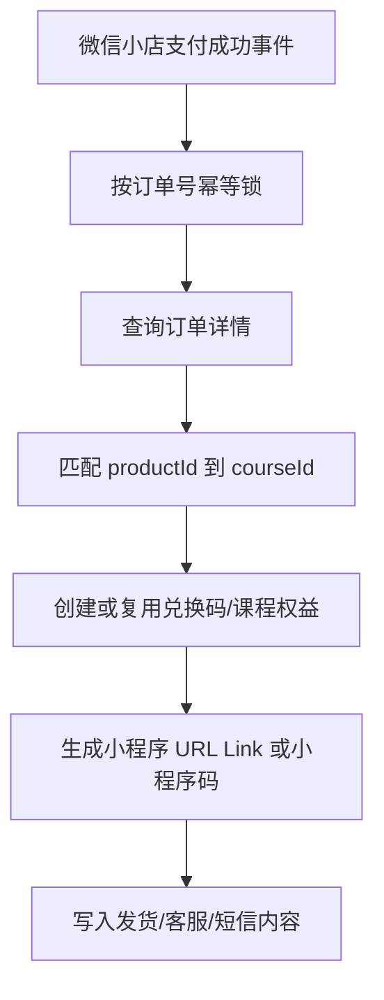

# 微信小店商品页与小程序跳转对接方案

更新日期：2026-07-02

## 结论先行

本项目必须同时支持两条业务链路：

1. GEO 小程序内购买入口：用户从 GEO 小程序课程页进入微信小店商品详情页，完成购买后回到 GEO 小程序开通课程。
2. 视频号/直播购买入口：用户从视频号短视频、直播间、橱窗等场景进入微信小店购买课程，完成购买后进入 GEO 小程序开通课程。

当前公开可查的微信小店/小程序能力里，稳定开放的是“小程序内嵌微信小店首页或商品，并从小程序跳转到微信小店完成交易”。微信小店标准商品详情页没有公开的通用配置项或 API，允许商家在商品详情页上放一个任意跳转到自有小程序页面的按钮。也就是说，视频号/直播来源必须支持“买完回 GEO 小程序开课”，但不能把“支付完成页自动跳转”作为唯一实现路径。

因此，两条链路都要用同一套“微信小店订单回传 + GEO 课程权益开通 + 小程序购后承接”闭环来实现。小程序入口负责购前导购；视频号/直播入口负责公域成交；订单支付完成后统一通过小程序 URL Link、小程序码、兑换码、虚拟发货说明或客服消息把用户带回 GEO 小程序。

如果业务要求“支付成功页自动无感跳转到 GEO 小程序指定页面”，需要向微信小店后台/平台招商确认是否有灰度能力。不要把它当成标准自研接口开发。工程侧必须先落地可控的购后承接链路，再评估是否叠加灰度跳转能力。

## 能力边界

### 官方稳定方向：小程序跳微信小店

微信小程序侧可使用微信小店相关原生组件：

- `store-home`：在小程序内展示微信小店首页，点击后进入小店交易场景。
- `store-product`：在小程序内展示微信小店商品，点击后进入小店商品交易场景。

`store-product` 需要的小店 `appid` 可以在微信小店后台的店铺基础信息里获取；商品 `productId` 可以通过微信小店商品 API 或后台商品列表的规格/编码获取。平台也明确要求组件必须在真实小程序环境验证，且不支持微信 Windows/Mac 小程序环境。

### 必须支持方向二：视频号/直播微信小店购买后回小程序

视频号短视频、直播间、橱窗挂微信小店商品后，用户可以直接在微信小店场景完成购买。这个入口没有先经过 GEO 小程序，所以不能依赖前端本地状态、课程页参数或小程序 session。必须以微信小店订单为唯一可信来源，在服务端完成课程权益创建，再把用户带到 GEO 小程序承接页。

标准微信小店商品详情页和支付完成页是否能配置“自动跳转 GEO 小程序指定 path”，需要以当前店铺后台和平台招商能力为准。公开自研文档下，应按以下方式保证业务闭环：

| 回小程序方式 | 是否必须支持 | 适用场景 | 说明 |
| --- | --- | --- | --- |
| 虚拟发货说明内放兑换码 + 小程序入口 | 是 | 所有视频号/直播成交订单 | 最稳妥，平台链路变化时仍可开课 |
| 订单回调后生成小程序 URL Link | 是 | 发货说明、客服消息、短信、私域触达 | 用户点击后直达 GEO 承接页 |
| 小程序码 | 是 | 商品详情图、直播口播引导、客服图片 | 用户扫码进入兑换/开课页 |
| 客服消息承接 | 建议 | 用户咨询、售后、未开课提醒 | 受微信客服消息规则限制 |
| 支付成功页自动跳 GEO 小程序 | 待确认 | 希望减少一步点击 | 需微信小店后台灰度或平台专项支持，不能作为唯一闭环 |

### 非标准方向：微信小店商品详情页购前跳小程序

截至本方案更新时间，公开文档没有给出“在微信小店商品详情页自定义跳转小程序 path”的标准自研接口。可选变通方案如下：

| 方案 | 可行性 | 适用场景 | 风险 |
| --- | --- | --- | --- |
| 小程序内嵌 `store-product`，从小程序导购到小店 | 高 | 自有小程序承接流量、微信小店完成交易 | 需要维护小程序页面与小店商品映射 |
| 购后自动发兑换码/小程序 URL Link/小程序码 | 高 | 小程序、视频号、直播间来源的课程订单 | 需要订单回传、幂等发货、售后退款处理 |
| 微信小店客服/商品说明引导用户搜索或扫码进小程序 | 中 | 人工服务、低频成交 | 不是直接跳转，转化链路长，需注意平台规则 |
| 腾讯广告/活动页选择小程序落地页 | 中 | 投放、公域活动 | 属于广告资源，不是微信小店商品页自研能力 |
| 在微信小店商品详情页放自定义小程序跳转按钮 | 低 | 需要微信灰度或平台专项支持 | 标准自研链路暂不可依赖 |

其中“购后自动发兑换码/小程序 URL Link/小程序码”的详细落地方案见 [wechat-store-post-purchase-fulfillment.md](./wechat-store-post-purchase-fulfillment.md)。

## 推荐整体架构



## 前置准备

### 微信小店侧

1. 开通并认证微信小店，完成教育/课程相关类目准入。
2. 上架课程对应商品，确认商品已通过审核并处于可售状态。
3. 将课程商品配置到视频号短视频、直播间、橱窗等销售入口。
4. 获取微信小店 ID，即 `store-product` 的 `appid`。
5. 获取商品 ID，即 `store-product` 的 `productId`。
6. 在微信小店后台进入“服务市场 - 经营工具 - 自研”，获取小店自研 `AppID`、`AppSecret`。
7. 配置服务端公网 HTTPS 回调地址、Token、消息密钥、IP 白名单。
8. 配置虚拟发货模板，至少包含兑换码、GEO 小程序名称、进入方式和客服入口。

### GEO 小程序侧

1. 确认 GEO 小程序已发布正式版，目标承接页面已经在 `apps/miniapp/src/app.config.ts` 注册。
2. 准备购后承接页，例如：
   - `/pages/redeem/index?code=xxx`
   - `/pages/course-unlock/index?orderId=xxx`
   - `/pages/course-detail/index?id=xxx&source=wechat_store`
3. 承接页必须支持没有登录态的用户进入：先展示订单/兑换码状态，再引导微信授权登录或绑定手机号。
4. 页面里不要直接访问微信小店后台或 Taro.request 到第三方 API。所有小店订单和权益状态统一经 `apps/miniapp/src/services/` 调用本项目服务端。

### GEO 服务端侧

1. 新增微信小店配置项：
   - `WECHAT_STORE_APP_ID`
   - `WECHAT_STORE_APP_SECRET`
   - `WECHAT_STORE_TOKEN`
   - `WECHAT_STORE_ENCODING_AES_KEY`
   - `WECHAT_MINIAPP_APP_ID`
   - `WECHAT_MINIAPP_APP_SECRET`
2. 新增订单回传表或扩展现有订单表，至少保存：
   - 微信小店订单号
   - 微信小店商品 ID
   - GEO 课程 ID
   - 来源场景：`miniapp`、`channels_video`、`channels_live`、`channels_showcase`、`unknown`
   - buyer/openid/unionid 可用标识
   - 支付状态
   - 发货状态
   - 兑换码或权益 ID
   - 幂等处理状态
3. 建立商品映射表：`wechat_store_product_id -> course_id`。

## 小程序内嵌微信小店商品

### 原生能力参数

`store-product` 核心参数：

| 参数 | 说明 |
| --- | --- |
| `appid` | 微信小店 ID，不是 GEO 小程序 AppID |
| `product-id` / `productId` | 微信小店商品 ID |
| `custom-content` / `customContent` | 是否启用自定义内容，以官方组件文档和真机实测为准 |
| `open-page` / `openPage` | 低代码封装文档中存在该属性；Taro/原生接入时需要按官方组件文档与真机结果确认 |
| `bindentersuccess` | 跳转小店成功回调 |
| `bindentererror` | 跳转小店失败回调 |

### Taro 4 注意事项

本项目是 Taro 4 + React。微信小店组件是微信原生组件，不是 `@tarojs/components` 的标准组件。社区已有 Taro React 下直接写 `<store-product>` 或 `<store-home>` 展示为空的案例，因此实现前必须做真实小程序环境验证。

建议顺序：

1. 先用原生微信小程序最小 demo 验证 `appid + productId` 有效。
2. 再在 Taro 页面做最小接入验证，使用微信开发者工具和真机预览，不以 H5 或 Taro preview 结果为准。
3. 如果 Taro 直接渲染原生标签失败，单独封装微信原生自定义组件，再由 Taro 页面引用该组件，避免在业务页面里散落兼容代码。
4. 组件展示必须保留微信要求的完整内容，不修改购买按钮高度、保障信息、销量信息等受限区域。

### 页面建议

GEO 课程详情页可以展示两类入口：

1. 主购买按钮：进入 GEO 自有开通/兑换流程。
2. 微信小店购买入口：展示 `store-product`，标注为“微信小店购买”。

如果课程只允许通过微信小店购买，则课程页仍应展示课程介绍、讲师、目录、评价等信息，购买区域使用微信小店商品卡承接交易。

## 视频号/直播入口购买后承接

### 入口特征

视频号入口包括：

- 视频号短视频挂商品。
- 视频号直播间挂商品。
- 视频号橱窗/主页商品。
- 微信小店其他公域商品分发入口。

这些入口的共同点是：用户购买前可能没有打开过 GEO 小程序。因此系统不能假设已经存在 GEO 用户 ID、课程页上下文或小程序登录态。

### 必须落地的购后流程



### 承接页要求

承接页要兼容三种进入方式：

1. URL Link 带 `orderId` 或一次性 `claimToken` 进入，服务端核验后开通课程。
2. 用户手动输入兑换码进入，服务端核验后绑定当前用户。
3. 用户扫码小程序码进入，页面读取 `scene` 参数，再向服务端换取订单或兑换码状态。

`claimToken` 不要直接等同于微信小店订单号。推荐使用服务端生成的一次性短 token，绑定订单号、商品 ID、过期时间和使用状态，避免订单号泄露后被撞库。

### 自动跳转的替代方案

如果必须做到“视频号入口点击后直接进入 GEO 小程序并在小程序内完成交易”，应评估小程序交易组件/视频号场景接入，而不是标准微信小店商品页跳转。该方案本质是把交易承接到 GEO 小程序内，和“视频号下方挂微信小店商品”是两套商品/订单能力，需要单独评估类目、交易组件、订单、发货和售后规则。

## 购后回跳小程序

### 订单回传

服务端需要接入微信小店消息推送：

1. GET：用于微信小店后台校验服务器地址。
2. POST：用于接收订单、发货、售后等事件。
3. 对 POST 请求做签名校验和消息解密。
4. 根据微信小店订单号做幂等处理，避免重复发货、重复开通课程。
5. 查询订单详情，确认支付状态和商品明细后再创建 GEO 权益。

### 权益开通

推荐使用“订单记录 + 兑换码/权益记录”的双层结构：



关键规则：

- 不信任前端传入的订单号或兑换码状态，最终以服务端订单和权益表为准。
- 退款成功后需要撤销未使用兑换码，或冻结已开通权益，具体按业务规则处理。
- 一笔订单多个商品时，按商品明细逐项创建权益。
- 所有微信回调处理都必须幂等。

### 用户回到小程序的方式

| 方式 | 推荐度 | 说明 |
| --- | --- | --- |
| 小程序 URL Link | 高 | 适合发在短信、客服消息、发货说明、网页中，用户点击直达指定页面 |
| 小程序码 | 高 | 适合商品详情图、客服图片、线下物料，扫码进入指定页面 |
| 兑换码文本 | 高 | 最稳妥，用户复制到小程序兑换页使用 |
| 客服消息 | 中 | 受客服消息规则限制，需要用户触达/会话窗口条件 |
| 商品详情页直接按钮 | 低 | 标准公开能力不足，不作为主方案 |

对视频号/直播来源订单，前三种方式必须同时准备：发货说明里有兑换码，系统生成 URL Link，客服或运营能拿到小程序码兜底。

## 后端接口建议

### 配置

```ts
export interface WechatStoreConfig {
  storeAppId: string
  storeAppSecret: string
  token: string
  encodingAESKey: string
  miniappAppId: string
  miniappAppSecret: string
}
```

### Webhook 路由

建议路由：

- `GET /api/wechat-store/callback`
- `POST /api/wechat-store/callback`

处理要求：

1. GET 返回微信校验需要的明文。
2. POST 先验签，再解密，再落库。
3. 回调处理立即响应成功，耗时任务进入队列或异步任务。
4. 失败任务支持重试，重试仍保持幂等。

### 小程序服务接口

小程序页面只调用本项目服务端：

- `GET /api/store-orders/:orderId/unlock-status`
- `POST /api/redeem-codes/claim`
- `GET /api/courses/:id/access`
- `GET /api/wechat-store/claim-tokens/:token`

不要在小程序端直接调用微信小店 API，也不要把小店 `AppSecret` 下发到前端。

## 验收清单

### 购前

- 小程序真机可正常展示 `store-product`。
- 点击商品卡能进入正确微信小店商品详情页。
- 视频号短视频/直播间/橱窗能挂载正确课程商品。
- 商品下架、审核中、库存不足时有兜底展示。
- Taro 页面没有直接 import `apps/miniapp/src/data/`。
- Taro 页面没有直接调用 `Taro.request` 访问微信小店 API。

### 购后

- 微信小店支付成功后，服务端能在 1 分钟内收到并处理回调。
- 同一订单重复回调不会重复发兑换码或重复开课。
- 用户通过 URL Link/小程序码/兑换码进入 GEO 小程序后能开通对应课程。
- 从视频号/直播购买的用户，即使之前从未打开 GEO 小程序，也能通过购后承接页完成登录、绑定和开课。
- 已退款订单不能继续兑换；已兑换订单退款后的权益处理符合业务规则。
- 订单、兑换码、课程权益之间可追踪。

### 合规与体验

- 商品详情、发货说明、客服话术不承诺无法自动完成的跳转。
- 虚拟课程类商品的类目、发货、售后说明与微信小店规则一致。
- 小程序链接、二维码和兑换码不过度暴露用户隐私或订单敏感信息。

## 开发排期建议

| 阶段 | 内容 | 产出 |
| --- | --- | --- |
| P0 验证 | 原生 demo + Taro 真机验证 `store-product` | 确认可展示、可跳转 |
| P1 视频号验证 | 视频号短视频/直播间/橱窗挂载课程商品 | 公域入口可购买 |
| P2 数据 | 商品映射、订单回传表、兑换码/权益表、来源场景 | 数据契约稳定 |
| P3 回调 | 微信小店 webhook、验签解密、订单幂等 | 支付后自动生成权益 |
| P4 承接 | 小程序兑换页/开课页、服务层接口、claimToken | 用户可回到小程序开课 |
| P5 售后 | 退款、重复回调、异常补偿、后台查询 | 闭环可运营 |

## 需要向微信侧确认的问题

上线前建议向微信小店运营或后台客服确认：

1. 当前店铺类目是否允许课程/虚拟服务类商品销售。
2. 商品详情页是否有灰度的“小程序跳转”配置能力。
3. 虚拟发货内容是否允许包含小程序 URL Link、兑换码、小程序码。
4. 订单支付、退款、发货相关消息推送的事件类型和字段，以当前后台文档为准。
5. 使用腾讯广告或活动资源时，是否可以直接配置 GEO 小程序 AppID、gh_id、path。

## 参考资料

- 微信小店商品组件说明：<https://developers.weixin.qq.com/miniprogram/dev/component/store-product.html>
- 微信小店首页组件说明：<https://developers.weixin.qq.com/miniprogram/dev/component/store-home.html>
- 腾讯云 CloudBase 对微信小店商品组件的说明：<https://docs.cloudbase.net/lowcode/components/wedaUI/src/docs/compsdocs/wxOpen/WdStoreProduct>
- 腾讯云 CloudBase 对微信小店首页组件的说明：<https://docs.cloudbase.net/lowcode/components/wedaUI/src/docs/compsdocs/wxOpen/WdStoreHome>
- 微信小店商品 API：<https://developers.weixin.qq.com/doc/store/API/product/get.html>
- 小程序 URL Link：<https://developers.weixin.qq.com/miniprogram/dev/OpenApiDoc/qrcode-link/url-link/generateUrlLink.html>
- Taro `store-product` / `store-home` 兼容问题记录：<https://github.com/NervJS/taro/issues/17088>
