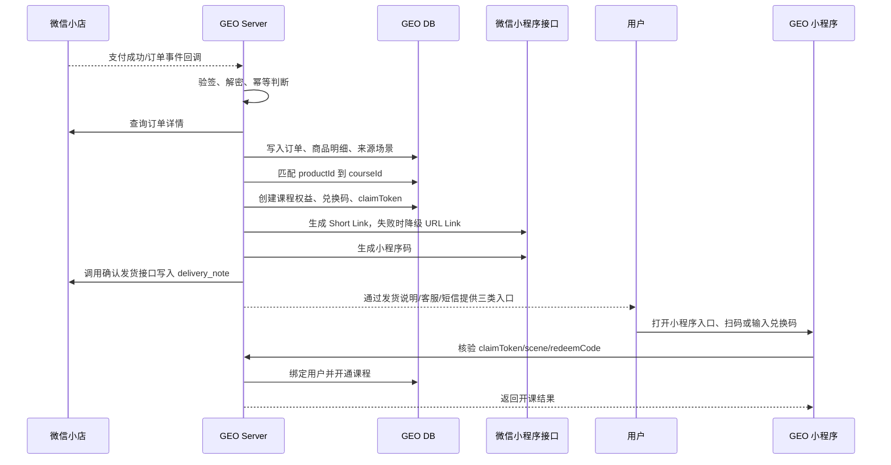
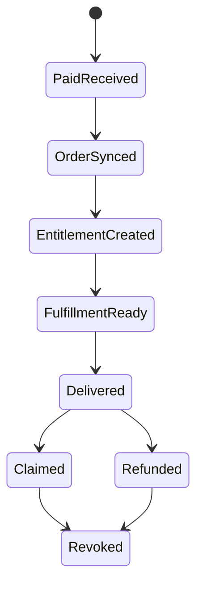

# 微信小店购后自动发兑换码、小程序入口、小程序码实施方案

更新日期：2026-07-03

## 目标

本方案解决微信小店课程订单支付后，自动把用户带回 GEO 小程序开课的问题。适用入口包括：

- GEO 小程序内点击微信小店商品购买。
- 视频号短视频挂商品购买。
- 视频号直播间挂商品购买。
- 视频号橱窗、微信小店店铺页等其他微信小店成交入口。

最终交付要求：每笔有效课程订单支付成功后，系统自动生成并投递三类承接方式：

1. 兑换码：用户可在 GEO 小程序兑换页手动输入。
2. 小程序入口：优先使用 Short Link（如 `#小程序://同养AI/首页/ZUUloHP4YkniZvi`），失败时降级 URL Link。
3. 小程序码：用户扫码进入 GEO 小程序承接页。

三者必须绑定同一个服务端权益记录，不能各自独立开课。

## 核心原则

1. 以微信小店订单为唯一可信来源，不信任前端传入的订单状态。
2. 订单回调必须幂等，同一订单重复回调不能重复发码、重复开课。
3. 兑换码、小程序入口、小程序码只是不同入口，最终都进入同一个 `claimToken` 核验流程。
4. 用户购买前可能没有 GEO 账号；承接页必须支持先核验订单，再登录/绑定用户。
5. 退款、售后、重复支付、重复领取必须可追踪、可撤销、可人工补偿。

## 总体流程



## 数据模型

### `wechat_store_orders`

保存微信小店订单主记录。

| 字段 | 说明 |
| --- | --- |
| `id` | 内部订单 ID |
| `store_order_id` | 微信小店订单号，唯一 |
| `source_scene` | `miniapp`、`channels_video`、`channels_live`、`channels_showcase`、`store`、`unknown` |
| `buyer_openid` | 小店侧可获得的买家 openid，没有则为空 |
| `buyer_unionid` | 可获得时保存，用于跨应用识别 |
| `pay_status` | `pending`、`paid`、`closed`、`refunded` |
| `fulfillment_status` | `pending`、`ready`、`delivered`、`failed` |
| `raw_payload` | 回调或订单详情原始 JSON |
| `paid_at` | 支付时间 |
| `created_at` / `updated_at` | 时间戳 |

### `wechat_store_order_items`

保存订单商品明细。

| 字段 | 说明 |
| --- | --- |
| `id` | 内部明细 ID |
| `store_order_id` | 微信小店订单号 |
| `store_product_id` | 微信小店商品 ID |
| `store_sku_id` | 微信小店 SKU ID |
| `course_id` | GEO 课程 ID |
| `quantity` | 购买数量 |
| `item_status` | `paid`、`fulfilled`、`claimed`、`refunded` |

### `course_entitlements`

保存课程权益。

| 字段 | 说明 |
| --- | --- |
| `id` | 权益 ID |
| `course_id` | GEO 课程 ID |
| `user_id` | 领取后绑定的 GEO 用户 ID，未领取时为空 |
| `source_type` | 固定为 `wechat_store` |
| `source_order_id` | 微信小店订单号 |
| `source_order_item_id` | 微信小店订单明细 ID |
| `status` | `unclaimed`、`active`、`revoked`、`expired` |
| `claimed_at` | 领取时间 |

### `redeem_codes`

保存兑换码。当前代码为了兼容旧兑换码核销和客服补发，会同时保存旧版明文字段 `code` 与 `code_hash`；生产高安全版本可进一步把 `code` 改为加密字段或只保留 hash。

| 字段 | 说明 |
| --- | --- |
| `id` | 兑换码 ID |
| `code` | 明文兑换码，兼容旧流程和客服补发 |
| `code_hash` | 兑换码 hash，唯一 |
| `code_suffix` | 后 4 位，便于客服核对 |
| `entitlement_id` | 绑定权益 ID |
| `status` | `unused`、`used`、`revoked`、`expired` |
| `expires_at` | 过期时间 |

### `claim_tokens`

保存小程序入口和小程序码共用的领取 token。

| 字段 | 说明 |
| --- | --- |
| `id` | token ID |
| `token_hash` | token hash，唯一 |
| `short_code` | 32 字符以内短码，用于小程序码 `scene` |
| `entitlement_id` | 绑定权益 ID |
| `store_order_id` | 微信小店订单号 |
| `status` | `active`、`claimed`、`revoked`、`expired` |
| `expires_at` | 过期时间 |

### `fulfillment_logs`

保存每次发货/投递记录。

| 字段 | 说明 |
| --- | --- |
| `id` | 日志 ID |
| `store_order_id` | 微信小店订单号 |
| `channel` | `redeem_code`、`short_link`、`url_link`、`qrcode`、`store_delivery`、`customer_service`、`sms` |
| `status` | `success`、`failed`、`retrying` |
| `payload` | 投递内容摘要，不保存完整敏感链接 |
| `error_message` | 失败原因 |
| `created_at` | 时间戳 |

## 幂等设计

### 幂等键

订单回调处理使用以下幂等键：

```text
wechat_store:{event_type}:{store_order_id}:{store_product_id}:{store_sku_id}
```

如果回调里没有商品明细，则先按订单维度落库，再查询订单详情补齐明细。

### 状态机



关键约束：

- `EntitlementCreated` 对同一 `store_order_id + store_product_id + store_sku_id` 只能成功一次。
- `Delivered` 可以重复执行，但必须复用同一兑换码、小程序入口、小程序码。
- `Claimed` 后再次打开链接，应展示“已开通课程”，不能再次绑定到另一个用户。
- `Refunded` 后未领取权益直接作废；已领取权益按业务规则撤销或转人工处理。

## 兑换码方案

### 生成规则

推荐格式：

```text
GEO-XXXX-XXXX
```

要求：

- 使用服务端安全随机数生成，不使用订单号、手机号、时间戳直接拼接。
- 明文只在生成时用于发货说明、客服消息或短信。
- 当前实现同时保存 `code` 与 `sha256(code + serverSalt)`；如后续不需要客服查看明文，可改为只保存 hash。
- 默认有效期建议 90 天，可按课程售卖规则调整。

### 兑换接口

```http
POST /api/redeem-codes/claim
Content-Type: application/json

{
  "code": "GEO-ABCD-EFGH"
}
```

服务端处理：

1. 校验登录态；未登录时返回需要登录。
2. hash 后查找兑换码。
3. 校验状态、有效期、退款状态。
4. 将 `course_entitlements.user_id` 绑定到当前用户。
5. 标记兑换码 `used`，权益 `active`。
6. 返回课程 ID 和跳转路径。

## 小程序入口方案

### 生成方式

服务端优先调用微信小程序 Short Link 接口生成直达链接，目标页面建议：

```text
/pages/video-unlock/index
```

query 示例：

```text
token=CLAIM_TOKEN&source=wechat_store
```

注意：

- Short Link 和 URL Link 必须由服务端生成，不能在小程序前端生成。
- `CLAIM_TOKEN` 使用随机 token，不直接暴露微信小店订单号。
- Short Link 请求体使用 `page_url` 承载页面和 query；降级 URL Link 时使用 `env_version=release`。
- 小程序入口过期后，承接页要提示用户输入兑换码或联系客服。

### 承接接口

```http
GET /api/wechat-store/claim-tokens/:token
```

返回示例：

```json
{
  "status": "active",
  "courseId": 101,
  "courseTitle": "GEO 入门课程",
  "orderStatus": "paid",
  "claimStatus": "unclaimed",
  "requiresLogin": true
}
```

登录后绑定：

```http
POST /api/wechat-store/claim-tokens/:token/claim
```

服务端处理：

1. hash token 后查找 `claim_tokens`。
2. 校验 token 状态、有效期、退款状态。
3. 如果权益未绑定用户，则绑定当前登录用户。
4. 如果已绑定当前用户，返回已开通。
5. 如果已绑定其他用户，返回不可重复领取并提示联系客服。

## 小程序码方案

### 生成方式

服务端调用微信小程序“不限制的小程序码”接口，目标页面同样使用：

```text
pages/course-unlock/index
```

`scene` 使用 `claim_tokens.short_code`，必须控制在微信接口允许的长度内。不要把订单号、手机号、兑换码明文塞进 `scene`。

小程序页面读取方式：

```ts
const scene = decodeURIComponent(options.scene || '')
```

然后调用：

```http
GET /api/wechat-store/claim-scenes/:scene
```

服务端用 `scene` 换取真实 `claimToken` 状态，再走同一套领取逻辑。

### 存储与投递

- 生成的小程序码图片存储在服务端对象存储或静态资源目录。
- `fulfillment_logs` 只记录图片资源 ID，不记录完整公网敏感链接。
- 客服后台、运营后台可按订单号查询小程序码并补发。

## 虚拟发货内容模板

微信小店客服已确认自研接口支持在确认发货时写入发货说明：

- 接口：`/order/confirm_delivery`
- 字段：`delivery_note`
- 效果：内容会同步到买家订单详情页
- 限制：最大 1000 个字符，支持小程序 Short Link 或 URL Link

微信小店虚拟发货或发货说明建议包含三段信息：

```text
您购买的《{{courseTitle}}》已生成学习权益。

兑换码：{{redeemCode}}
点击前往学习：{{urlLink}}
也可打开 GEO 课程小程序，进入「我的 - 兑换课程」输入兑换码。

如已兑换但无法观看，请联系客服并提供订单号：{{storeOrderId}}
```

不要在发货说明里承诺“支付后会自动跳转”，除非该店铺已确认具备微信侧自动跳转能力。当前代码会把渲染后的文案作为 `delivery_note` 传给确认发货接口。

### 模板变量如何替换

`{{courseTitle}}`、`{{urlLink}}`、`{{redeemCode}}`、`{{storeOrderId}}` 不是微信小店自动替换的变量，而是 GEO Server 在执行发货前渲染出来的占位符。`{{urlLink}}` 当前表示小程序入口，代码会优先生成类似 `#小程序://同养AI/首页/ZUUloHP4YkniZvi` 的 Short Link；如果 Short Link 接口失败，再降级生成普通 URL Link。

渲染时机：

1. 微信小店支付成功回调进入 GEO Server。
2. 服务端查询订单详情，拿到 `storeOrderId`、商品 ID、SKU、买家信息。
3. 服务端通过 `wechat_store_product_id -> course_id` 映射查到课程。
4. 服务端创建或复用课程权益、兑换码、claimToken。
5. 服务端调用微信小程序接口生成小程序入口和小程序码。
6. 服务端把模板里的变量替换成真实值，得到最终发货文案。
7. 服务端把最终文案写入微信小店虚拟发货说明，或提供给客服/短信/后台补发。

变量来源：

| 变量 | 来源 | 示例 |
| --- | --- | --- |
| `{{courseTitle}}` | `courses.title` 或本地课程表 | `GEO 入门课程` |
| `{{urlLink}}` | `wechat-miniapp-api.ts` 优先调微信 Short Link 接口生成，失败时降级 URL Link | `#小程序://同养AI/首页/ZUUloHP4YkniZvi` |
| `{{redeemCode}}` | `redeem-code.service.ts` 生成的兑换码明文 | `GEO-ABCD-EFGH` |
| `{{storeOrderId}}` | 微信小店订单号 | `1234567890` |

推荐在服务端实现一个小的渲染函数：

```ts
interface FulfillmentTemplateContext {
  courseTitle: string
  urlLink: string
  redeemCode: string
  storeOrderId: string
}

const fulfillmentTemplate = `您购买的《{{courseTitle}}》已生成学习权益。

兑换码：{{redeemCode}}
点击前往学习：{{urlLink}}
也可打开 GEO 课程小程序，进入「我的 - 兑换课程」输入兑换码。

如已兑换但无法观看，请联系客服并提供订单号：{{storeOrderId}}`

function renderFulfillmentTemplate(context: FulfillmentTemplateContext): string {
  return fulfillmentTemplate.replace(/\{\{(\w+)\}\}/g, (_, key: keyof FulfillmentTemplateContext) => {
    const value = context[key]
    if (!value) return ''
    return value
  })
}
```

生产实现里不要只做字符串替换后直接发货，还要在渲染前校验必需变量：

```ts
const requiredKeys: Array<keyof FulfillmentTemplateContext> = [
  'courseTitle',
  'urlLink',
  'redeemCode',
  'storeOrderId',
]
```

`delivery_note` 最大 1000 字符，生产实现需要保留兑换码和小程序入口这两个核心信息，必要时裁剪课程名或辅助说明。当前代码已做长度兜底。小程序入口优先使用 Short Link，失败后降级 URL Link；如果入口和小程序码都生成失败，不能投递不可用链接，应记录失败日志并等待重试或人工处理。`fulfillment_logs` 需要记录本次实际投递了哪些内容。

## API 与服务模块建议

当前代码已按本章节落地：微信小店/视频号回调会调用 `wechat-store-fulfillment.ts`，生成兑换码、小程序入口、小程序码，并写入发货日志。小程序入口优先为 Short Link，回退为 URL Link。

### 服务端模块

```text
apps/server/src/routes/wechat-store.ts
apps/server/src/services/wechat-store-fulfillment.ts
apps/server/src/services/wechat-miniapp-api.ts
apps/server/src/services/channels-api.ts
```

### 对外路由

| 路由 | 用途 |
| --- | --- |
| `GET /api/channels/webhook` | 微信小店/视频号小店回调地址校验 |
| `POST /api/channels/webhook` | 接收微信小店/视频号小店订单事件 |
| `GET /api/wxshop/order/callback` | 小程序消息推送回调地址校验 |
| `POST /api/wxshop/order/callback` | 接收小程序内微信小店订单事件 |
| `GET /api/wechat-store/claim-tokens/:token` | 查询小程序入口承接状态 |
| `POST /api/wechat-store/claim-tokens/:token/claim` | 领取小程序入口绑定的课程权益 |
| `GET /api/wechat-store/claim-scenes/:scene` | 小程序码 scene 换取领取状态 |
| `POST /api/wechat-store/claim-scenes/:scene/claim` | 领取小程序码绑定的课程权益 |
| `POST /api/redeem` | 兑换码领取，已兼容新权益模型 |

### 小程序服务层

小程序页面必须通过 `apps/miniapp/src/services/` 调用本项目服务端，不直接调用微信小店或微信开放接口。

建议新增：

```text
apps/miniapp/src/services/wechat-store.ts
```

导出：

```ts
export async function getClaimTokenStatus(token: string): Promise<ClaimStatus>
export async function claimByToken(token: string): Promise<ClaimResult>
export async function getClaimSceneStatus(scene: string): Promise<ClaimStatus>
export async function claimByScene(scene: string): Promise<ClaimResult>
```

并在 `apps/miniapp/src/services/index.ts` re-export。

## 必须配置清单

### 服务端环境变量

配置文件位置：

```text
apps/server/.env
apps/server/.env.production
apps/server/.env.example
```

必须配置：

| 变量 | 用途 | 要求 |
| --- | --- | --- |
| `BASE_URL` | 拼接小程序码图片 URL、外部访问地址 | 生产必须是公网 HTTPS 域名 |
| `WECHAT_APPID` | GEO 小程序 AppID，用于生成 Short Link、URL Link 和小程序码 | 必须是承接页所在小程序 |
| `WECHAT_SECRET` | GEO 小程序 AppSecret | 只放服务端，不下发前端 |
| `CHANNELS_TOKEN` | 微信小店自研消息推送 Token | 与微信小店后台一致 |
| `CHANNELS_ENCODING_AES_KEY` | 微信小店消息密钥 | 与微信小店后台一致 |
| `CHANNELS_APP_ID` | 微信小店主体接口 AppID | 微信小店后台「服务市场 - 自研」获取 |
| `CHANNELS_APP_SECRET` | 微信小店主体接口密钥 | 只在重置时显示一次 |
| `CHANNELS_CONFIRM_DELIVERY_PATH` | 微信小店确认发货接口路径 | 默认 `/order/confirm_delivery` |
| `FULFILLMENT_CLAIM_PAGE` | Short Link、URL Link、小程序码进入的页面 | 默认 `/pages/video-unlock/index` |
| `FULFILLMENT_REDEEM_SALT` | 兑换码 hash 盐 | 生产必须设置强随机值 |
| `FULFILLMENT_CLAIM_SALT` | claimToken hash 盐 | 生产必须设置强随机值 |
| `FULFILLMENT_CLAIM_EXPIRE_DAYS` | 兑换/领取有效期 | 默认 90 |
| `FULFILLMENT_URL_LINK_EXPIRE_DAYS` | 微信 URL Link 降级入口有效期 | 默认 30 |

### 数据库

全新数据库：

```bash
mysql -h 127.0.0.1 -P 3307 -u root -p geo_course < db/schema.sql
```

已有数据库：

```bash
mysql -h 127.0.0.1 -P 3307 -u root -p geo_course < db/migrations/20260702_wechat_store_fulfillment.sql
```

然后在 `wxshop_products` 里配置微信小店商品与课程映射：

```sql
INSERT INTO wxshop_products (product_id, product_title, course_id, course_title, status)
VALUES ('微信小店商品ID', '商品标题', 1, 'GEO 课程标题', 1)
ON DUPLICATE KEY UPDATE
  product_title = VALUES(product_title),
  course_id = VALUES(course_id),
  course_title = VALUES(course_title),
  status = 1;
```

### 微信小店后台

1. 在微信小店后台「服务市场 - 自研」配置消息推送。
2. 回调地址填写：

```text
https://你的服务端域名/api/channels/webhook
```

3. Token 填 `CHANNELS_TOKEN`。
4. EncodingAESKey 填 `CHANNELS_ENCODING_AES_KEY`。
5. 在自研接口凭证处保存 `CHANNELS_APP_ID`、`CHANNELS_APP_SECRET`。
6. 确认「订单发货」接口 `/order/confirm_delivery` 可用，并支持 `delivery_note` 字段。
7. 将服务端公网出口 IP 加入「微信小店后台 - 开发管理 - 接口权限」中的 IP 白名单。
8. 课程商品必须在视频号短视频、直播间、橱窗或小店商品页正确挂载。

### 微信小程序后台

1. `WECHAT_APPID` 对应的小程序必须已发布正式版。
2. 承接页 `/pages/video-unlock/index` 必须在 `apps/miniapp/src/app.config.ts` 注册。
3. 小程序服务器域名必须配置服务端 HTTPS 域名，否则小程序内 API 请求会失败。
4. Short Link、URL Link 和小程序码生成需要小程序 `AppSecret` 有效。

### 小程序前端

`apps/miniapp/.env.production` 中：

```text
TARO_APP_BASE_URL=https://你的服务端域名
```

然后重新构建并上传小程序：

```bash
pnpm build:miniapp
```

## 联调步骤

### 真机链路验证

1. 在数据库确认 `wxshop_products.product_id` 与微信小店商品 ID 一致。
2. 微信小店下一笔测试订单。
3. 查看服务端日志是否出现订单回调。
4. 查询数据库：

```sql
SELECT * FROM wechat_store_orders ORDER BY id DESC LIMIT 1;
SELECT * FROM course_entitlements ORDER BY id DESC LIMIT 1;
SELECT code_suffix, status FROM redeem_codes ORDER BY id DESC LIMIT 1;
SELECT short_code, url_link, qrcode_url, status FROM claim_tokens ORDER BY id DESC LIMIT 1;
SELECT channel, status, error_message FROM fulfillment_logs ORDER BY id DESC LIMIT 10;
```

5. 在微信小店买家订单详情页查看发货说明，应能看到兑换码和小程序入口。正常情况下入口应是类似 `#小程序://同养AI/首页/ZUUloHP4YkniZvi` 的 Short Link；如果短链接口不可用，会降级为 URL Link。
6. 用返回的小程序入口或小程序码进入 `/pages/video-unlock/index`。
7. 未登录时应先展示课程权益；登录后点击开通，课程进入「我的课程」。
8. 用兑换码手动兑换也应开通同一门课程，且不会重复创建权益。

## 承接页交互

建议页面：

```text
apps/miniapp/src/pages/video-unlock/index.tsx
```

页面状态：

| 状态 | 展示 |
| --- | --- |
| `loading` | 正在确认订单 |
| `active + not_login` | 展示课程信息，引导微信登录/绑定手机号 |
| `active + logged_in` | 展示“立即开通课程” |
| `claimed_current_user` | 展示“已开通”，按钮进入课程详情 |
| `claimed_other_user` | 展示“该权益已被领取”，提示联系客服 |
| `refunded/revoked` | 展示“订单已退款或权益已失效” |
| `expired` | 展示“链接已过期”，引导输入兑换码 |
| `not_found` | 展示“未找到订单”，引导联系客服 |

## 退款与售后

### 未领取订单退款

1. 标记订单 `refunded`。
2. 标记兑换码 `revoked`。
3. 标记 claimToken `revoked`。
4. 标记课程权益 `revoked`。

### 已领取订单退款

按业务规则二选一：

1. 自动撤销课程访问：适合严格按订单权益控制的课程。
2. 转人工审核：适合已观看较多内容、存在争议或售后规则复杂的课程。

无论采用哪种，都必须保留售后记录，后台能按微信小店订单号查到处理结果。

## 异常补偿

| 异常 | 处理 |
| --- | --- |
| 回调没收到 | 定时任务按最近订单拉取微信小店订单详情补偿 |
| Short Link 生成失败 | 自动降级 URL Link，并记录 `short_link failed` 日志 |
| URL Link 也生成失败 | 不投递不可用链接，记录失败日志并等待重试或人工处理 |
| 小程序码生成失败 | 保留兑换码和小程序入口，进入重试队列 |
| 虚拟发货失败 | 后台展示失败订单，支持手动重试 |
| 用户不会操作 | 客服按订单号查询兑换码、小程序入口、小程序码补发 |
| 订单重复回调 | 命中幂等键后直接返回成功 |

## 后台运营能力

后台至少需要提供：

1. 按微信小店订单号查询课程权益。
2. 查看兑换码后四位、状态、领取用户、领取时间。
3. 查看小程序入口、小程序码生成状态。
4. 手动重试发货。
5. 手动作废兑换码/权益。
6. 查看退款处理状态。
7. 导出异常订单列表。

## 验收清单

### 正常订单

- 视频号直播下单后，服务端能收到订单并生成兑换码、小程序入口、小程序码。
- 小程序内跳微信小店下单后，走同一套发货和开课流程。
- 用户点击小程序入口，可进入正确课程承接页。
- 用户扫码小程序码，可进入正确课程承接页。
- 用户输入兑换码，可开通正确课程。
- 三种方式不会重复创建权益。

### 幂等

- 同一支付成功回调重复发送 3 次，只生成一份权益。
- 重复点击小程序入口，不会重复绑定到多个用户。
- 兑换码使用后再次输入，提示已使用。

### 售后

- 未领取订单退款后，兑换码、小程序入口、小程序码全部失效。
- 已领取订单退款后，按业务规则撤销或进入人工售后。
- 客服能通过微信小店订单号查到发货和领取状态。

### 安全

- Short Link、URL Link 和小程序码中不包含订单号、手机号、兑换码明文。
- 当前实现为兼容旧流程会保存兑换码明文和 hash；生产环境需限制数据库/后台访问权限，后续可升级为加密存储。
- 小程序端不保存微信小店 AppSecret，不直接调用微信开放接口。

## 参考资料

- 小程序 Short Link：<https://developers.weixin.qq.com/miniprogram/dev/OpenApiDoc/qrcode-link/short-link/generateShortLink.html>
- 小程序 URL Link：<https://developers.weixin.qq.com/miniprogram/dev/OpenApiDoc/qrcode-link/url-link/generateUrlLink.html>
- 获取不限制的小程序码：<https://developers.weixin.qq.com/miniprogram/dev/OpenApiDoc/qrcode-link/qr-code/getUnlimitedQRCode.html>
- 小程序稳定版接口调用凭据：<https://developers.weixin.qq.com/miniprogram/dev/OpenApiDoc/mp-access-token/getStableAccessToken.html>
- 微信小店商品 API：<https://developers.weixin.qq.com/doc/store/API/product/get.html>
